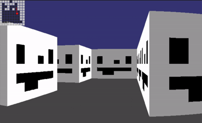

# 3d-ray-caster

A 3D raycasting engine built from scratch in C++ using SFML. Casts rays across a 2D tilemap using the DDA (Digital Differential Analysis) algorithm to render a perspective 3D view in real time, with textured walls, depth-based shading, and smooth collision detection.



## Requirements

- A C++ compiler (g++ or clang++)
- [SFML](https://www.sfml-dev.org/) 2.x

### Install SFML

**macOS (Homebrew):**
```bash
brew install sfml
```

**Linux (apt):**
```bash
sudo apt install libsfml-dev
```

## Build & Run

```bash
g++ main.cpp -o raycaster $(pkg-config --cflags --libs sfml-graphics sfml-window sfml-system)
./raycaster
```

## Controls

| Key | Action |
|-----|--------|
| `W` / `S` | Move forward / backward |
| `A` / `D` | Strafe left / right |
| `←` / `→` | Rotate left / right |

## License

MIT — see [LICENSE](LICENSE)